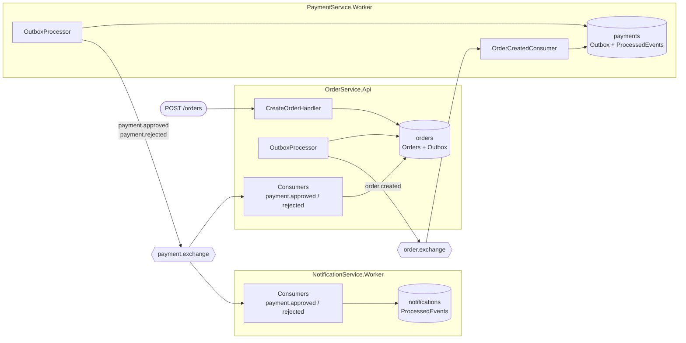

# ReliableMessaging

Projeto de estudo em .NET 10 que implementa uma malha de microsserviços orientada a eventos
sobre RabbitMQ, com foco em **entrega confiável de mensagens**: Outbox Pattern na publicação
e validação de idempotência no consumo.

O domínio (pedido → pagamento → notificação) é intencionalmente simples. O objetivo não é o
domínio, e sim exercitar o que acontece quando o broker cai, quando a transação falha no meio,
e quando a mesma mensagem chega duas vezes.

---

## Objetivo

Em sistemas distribuídos, salvar no banco e publicar no broker são duas operações que não
compartilham transação. Sem cuidado, dois problemas aparecem:

1. **Publicação perdida ou fantasma** — o pedido é salvo mas o broker está fora (evento nunca sai),
   ou o evento é publicado e o commit falha (evento existe para um pedido que não existe).
2. **Processamento duplicado** — RabbitMQ garante *at-least-once*. Um `Nack` com requeue, um
   redeploy no meio do processamento ou uma falha de rede depois do handler rodar fazem a mesma
   mensagem ser entregue de novo.

Este projeto resolve (1) com **Outbox Pattern** e (2) com uma **tabela de eventos processados**
gravada dentro da mesma transação do efeito colateral.

---

## Arquitetura



### Fluxo completo

1. `POST /orders` → `OrderService` salva o `Order` (status `Pending`) **e** o `OrderCreatedEvent`
   na tabela `OutboxMessages`, na mesma transação.
2. O `OutboxProcessor` do `OrderService` publica `order.created` em `order.exchange`.
3. `PaymentService` consome, simula o gateway de pagamento (delay de 3s + resultado aleatório)
   e grava na sua Outbox um `PaymentApprovedEvent` ou `PaymentRejectedEvent`, junto com o
   registro de idempotência do `OrderCreatedEvent`.
4. O `OutboxProcessor` do `PaymentService` publica em `payment.exchange`.
5. `OrderService` consome e move o pedido para `Confirmed` / `Cancelled`.
   `NotificationService` consome em paralelo (fila própria) e loga a notificação ao cliente.

### Topologia RabbitMQ

Dois exchanges do tipo **topic**, duráveis. Cada consumidor tem fila própria — `payment.approved`
é fan-out lógico para duas filas distintas, então `OrderService` e `NotificationService` recebem
cópias independentes da mesma mensagem.

| Exchange | Routing key | Fila | Consumidor |
|---|---|---|---|
| `order.exchange` | `order.created` | `order.created.payments` | PaymentService |
| `payment.exchange` | `payment.approved` | `payment.approved.orders` | OrderService |
| `payment.exchange` | `payment.approved` | `payment.approved.notifications` | NotificationService |
| `payment.exchange` | `payment.rejected` | `payment.rejected.orders` | OrderService |
| `payment.exchange` | `payment.rejected` | `payment.rejected.notifications` | NotificationService |

Publicação com `DeliveryMode.Persistent`, `mandatory: true` e publisher confirms habilitados.
Consumo com `autoAck: false` e `prefetchCount: 30`.

### Projetos

| Projeto | Tipo | Responsabilidade |
|---|---|---|
| `OrderService.Api` | ASP.NET Core Minimal API | Criação/consulta de pedidos; produtor de `order.created`; consumidor de `payment.*` |
| `PaymentService.Worker` | Worker Service | Consome `order.created`, simula o pagamento, produz `payment.approved`/`payment.rejected` |
| `NotificationService.Worker` | Worker Service | Consome `payment.*` e notifica o cliente (log) |
| `Shared.Contracts` | Class Library | Records dos eventos + base `Event` com `EventId` |
| `BuildingBlocks` | Class Library | `IMessageBusConnection` e a implementação `RabbitMqConnection` |

Cada serviço tem seu **próprio banco PostgreSQL** (`orders`, `payments`, `notifications`) —
nenhum acessa a tabela do outro.

---

## Experimentos interessantes

O valor do projeto está em quebrar as coisas de propósito:

- **Broker fora do ar** — pare o container do RabbitMQ e continue criando pedidos. A API
  responde `201` normalmente, as mensagens acumulam em `OutboxMessages` com `RetryCount`
  incrementando. Suba o RabbitMQ de volta: tudo é publicado no próximo ciclo, em ordem.
- **Reentrega duplicada** — republique manualmente uma mensagem pela management UI do RabbitMQ
  com o mesmo `EventId`. O handler detecta pelo `ProcessedEvents` e ignora; o log mostra
  `Event {EventId} already processed. Skipping.`
- **Crash no meio do processamento** — mate o `PaymentService` durante o delay de 3s. Como o
  `Ack` só acontece depois do commit, o RabbitMQ reentrega a mensagem quando o serviço voltar.
- **Inspecionar a outbox**:
  ```sql
  SELECT "EventId", "Type", "OccurredOnUtc", "ProcessedOnUtc", "RetryCount", "Error"
  FROM "OutboxMessages" ORDER BY "OccurredOnUtc" DESC;
  ```
- **Múltiplas instâncias** — suba dois `PaymentService` apontando para o mesmo banco e veja o
  comportamento sob concorrência (ver *Limitações conhecidas*).

---

## Como rodar

Requer .NET SDK 10.0 e Docker.

```bash
docker compose up -d                              # RabbitMQ (5672 / UI 15672) + PostgreSQL (5432)

dotnet run --project OrderService.Api             # http://localhost:8000
dotnet run --project PaymentService.Worker
dotnet run --project NotificationService.Worker
```

Credenciais locais: `guest`/`guest` no RabbitMQ, `postgres`/`postgres` no PostgreSQL. Cada
serviço aplica as próprias migrations no startup, então não é preciso rodar `dotnet ef`.

| Método | Rota | Descrição |
|---|---|---|
| `POST` | `/orders` | Cria um pedido em `Pending` e enfileira `OrderCreatedEvent` na outbox |
| `GET` | `/orders/{id}` | Consulta o pedido e o status atual |

```bash
curl -X POST http://localhost:8000/orders -H "Content-Type: application/json" -d '{ "totalAmount": 250.00 }'
```

O status sai de `Pending` para `Confirmed` ou `Cancelled` em poucos segundos — o `OutboxProcessor`
roda a cada 5s e o pagamento simula 3s de latência.

---

## Como o Outbox Pattern foi implementado

### O problema

`SaveChangesAsync()` e `PublishAsync()` não compartilham transação. Se o processo morre entre as
duas chamadas, o pedido existe e ninguém nunca soube dele. Invertendo a ordem, um evento pode ser
publicado para um pedido que nunca foi salvo.

### A solução

O evento vira **uma linha na mesma transação do banco** — ou o pedido e o evento existem, ou
nenhum dos dois. Publicar deixa de ser responsabilidade do request e passa a ser de um processo
em background que lê essa tabela.

**Escrita** — `OrderService.Api/Handlers/CreateOrderHandler.cs` abre uma transação, faz
`Orders.Add(order)` e `OutboxMessages.Add(outboxMessage)`, e commita as duas juntas.

**Tabela `OutboxMessages`** (`Models/OutboxMessage.cs`):

| Coluna | Papel |
|---|---|
| `EventId` (PK) | O mesmo `Guid` do evento — vira o `MessageId` do AMQP e a chave de idempotência do consumidor |
| `Type` | Nome do tipo (`"OrderCreatedEvent"`), usado para desserializar e escolher a routing key |
| `Content` | Payload JSON do evento |
| `OccurredOnUtc` | Ordenação de publicação (FIFO) |
| `ProcessedOnUtc` | `null` = pendente; preenchido = já publicado |
| `RetryCount` | Tentativas de publicação |
| `Error` | Última mensagem de erro, para diagnóstico |

**Publicação** — `OutboxProcessor` (`BackgroundService`), presente no `OrderService` e no
`PaymentService`. A cada 5 segundos busca as pendentes:

```csharp
.Where(m => m.ProcessedOnUtc == null && m.RetryCount < maxRetryCount)
.OrderBy(m => m.OccurredOnUtc)
.Take(maxLimitMessages)
```

Para cada uma: desserializa pelo `Type`, mapeia para a routing key, publica e marca
`ProcessedOnUtc`. As mensagens só são marcadas depois do `SaveChangesAsync` do lote, então uma
falha antes disso faz a mensagem ser reprocessada no ciclo seguinte.

**Classificação de falhas** — o `catch` separa dois mundos, o que evita tanto retry infinito
quanto perda silenciosa. Falha **permanente** (`JsonException`, `InvalidOperationException`,
`NotSupportedException` — JSON inválido, tipo desconhecido no switch) força
`RetryCount = maxRetryCount` e aposenta a mensagem na hora; falha **transitória** (broker fora,
rede, timeout) só incrementa `RetryCount`. Mensagens que estouram o limite (5) saem da query e
ficam na tabela com o `Error` preenchido, servindo como uma dead-letter table consultável por SQL.

**Garantia resultante:** *at-least-once*. A publicação pode acontecer mais de uma vez (ex.: o
broker recebe a mensagem mas o processo morre antes de gravar `ProcessedOnUtc`). É exatamente
por isso que o lado consumidor precisa ser idempotente.

---

## Como a idempotência foi tratada

Como a entrega é *at-least-once*, todo handler parte do princípio de que **vai receber a mesma
mensagem mais de uma vez** e precisa produzir o mesmo resultado.

### A chave: `EventId`

Todo evento herda de `Event` (`Shared.Contracts/Events.cs`), que carrega um `Guid EventId`
gerado **uma vez**, no momento em que o evento entra na outbox. Ele viaja no JSON e no
`MessageId` do AMQP: reentrega da mesma mensagem = mesmo `EventId`. É a identidade que permite
reconhecer a duplicata.

### A tabela `ProcessedEvents`

Cada serviço consumidor tem a sua, com `EventId` como **chave primária** — o que transforma a
garantia de "não processar duas vezes" numa constraint do banco, e não numa checagem em memória.

### Proteção em duas camadas

**Camada 1 — checagem antecipada.** Um `ProcessedEvents.AnyAsync(e => e.EventId == ev.EventId)`
no início do handler faz `return` cedo e evita o trabalho no caso comum de reentrega. Sozinha,
essa checagem tem uma janela de corrida: duas entregas concorrentes podem passar pelo `AnyAsync`
antes de qualquer uma gravar. Daí a segunda camada.

**Camada 2 — a PK como árbitro.** O efeito colateral e o registro de idempotência são gravados na
**mesma transação** (`order.Status = Confirmed` + `ProcessedEvents.Add(...)` + commit). Se duas
entregas correrem em paralelo, a segunda bate na violação de PK e faz rollback — a atualização do
pedido é desfeita junto:

```csharp
catch (DbUpdateException ex) when (ex.InnerException is PostgresException { SqlState: "23505" })
{
    // 23505 = unique_violation: outra entrega chegou primeiro
    await transaction.RollbackAsync(ct);
    return;   // sucesso, não erro → a mensagem é ackada e descartada, não reenfileirada
}
```

Ou o efeito colateral **e** a marca são gravados, ou nenhum dos dois. Não existe estado em que o
pedido foi confirmado mas o serviço "esqueceu" de ter processado o evento.

### Idempotência + Outbox no mesmo handler

`PaymentService.Worker/Handlers/OrderCreatedHandler.cs` combina os dois padrões numa transação
única — `OutboxMessages.Add()` (o evento que vou produzir) e `ProcessedEvents.Add()` (a marca do
evento que consumi) commitam juntos. Um pagamento processado duas vezes nunca gera dois
`PaymentApprovedEvent`.

### Ack / Nack

O `Ack` só é enviado **depois** do commit do handler.

- `JsonException` → `Nack(requeue: false)` — payload malformado nunca vai desserializar; requeue
  seria loop infinito.
- Exceção genérica → `Nack(requeue: true)` — trata-se como falha transitória (banco fora, timeout):
  a mensagem volta para a fila e é reprocessada. É a idempotência que torna isso seguro; sem ela,
  o requeue reaplicaria o efeito colateral.
- Crash antes do `Ack` → o RabbitMQ reentrega, e a idempotência garante que reprocessar é seguro.

---

## Limitações conhecidas

Coisas deliberadamente fora do escopo, ou que um passo seguinte resolveria:

- **Sem DLQ e sem limite de retentativas no consumo.** Falhas genéricas fazem `Nack(requeue: true)`
  indefinidamente, então um erro determinístico (bug no handler, pedido inexistente) vira hot loop.
  Falta um dead-letter exchange com contagem de entregas para aposentar a mensagem — e, para o
  `JsonException`, o `Nack(requeue: false)` hoje descarta o payload silenciosamente.
- **Outbox sem lock entre instâncias.** O `OutboxProcessor` não usa `FOR UPDATE SKIP LOCKED`;
  com múltiplas instâncias do mesmo serviço, duas podem publicar a mesma mensagem. Como o
  consumo é idempotente, o efeito é absorvido — mas o ideal seria evitar a publicação duplicada.
- **Polling fixo de 5s.** Sem backoff exponencial no retry e sem gatilho imediato após a escrita.
- **`ProcessedEvents` cresce indefinidamente.** Falta um job de expurgo por `CreatedAt`.
- **Credenciais em `appsettings.json`.** Adequado só para ambiente local.

---

## Decisão de design: contratos compartilhados

`Shared.Contracts` é referenciado via `ProjectReference` pelos três serviços e contém apenas os
records de evento. O acoplamento gerado é de build/deploy, não de runtime: o contrato real que
trafega é o JSON. O custo é cadência de release independente — todos os serviços compilam contra
a mesma versão do contrato.

A alternativa usual em produção é distribuir os contratos como pacote NuGet versionado, com cada
serviço fixando a versão que consome. Para o escopo deste projeto, o `ProjectReference` é
suficiente e evita manter um feed NuGet privado.

---

## Stack

.NET 10 · ASP.NET Core Minimal APIs · Worker Services · RabbitMQ.Client 7.2 ·
Entity Framework Core 10 · PostgreSQL (Npgsql) · Docker Compose
